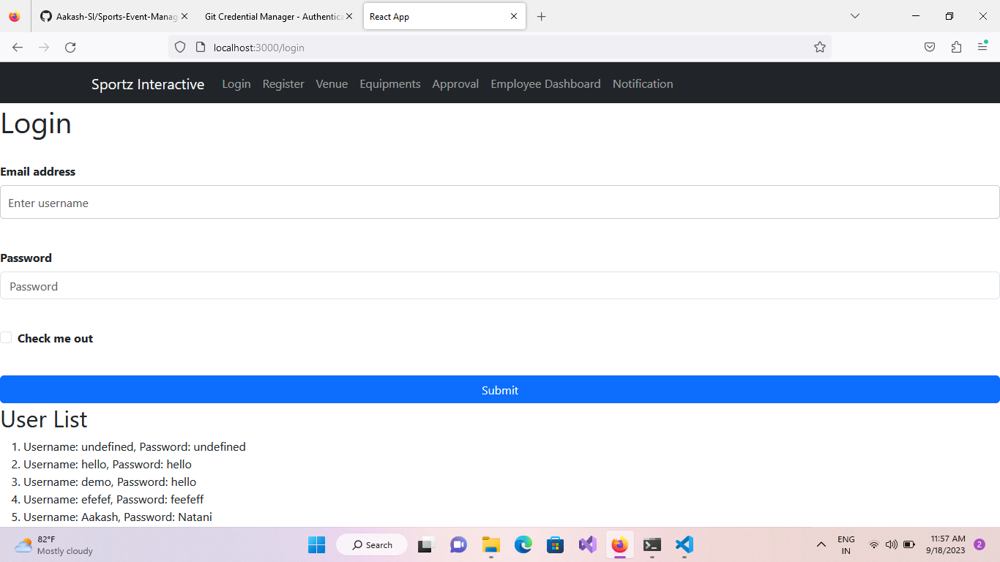
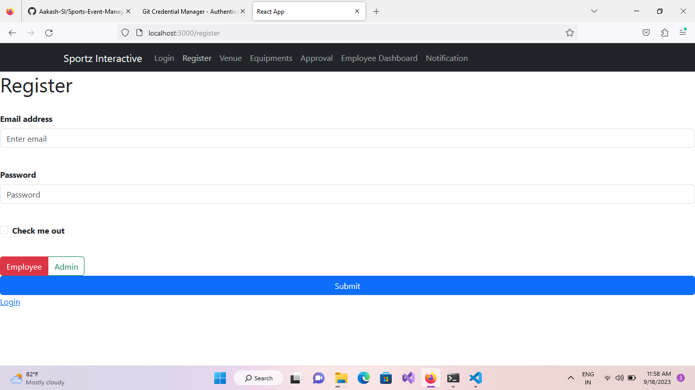

# Sports-Event-Management-System

Welcome to the Sports Event Management System! This repository contains all the information you need to get started with our system.

## Table of Contents
1. [Login](#1-login)
2. [Register](#2-register)
3. [HR DashBoard Venue](#3-hr-dashboard-venue)
4. [HR DashBoard Equipments](#4-hr-dashboard-equipments)
5. [HR DashBoard Approval](#5-hr-dashboard-approval)
6. [Employee Dashboard Booking](#6-employee-dashboard-booking)
7. [Employee Dashboard Notification](#7-employee-dashboard-notification)

## 1) Login

Add a concise description of the login feature here.

## 2) Register

Describe the registration process and its importance.

## 3) HR DashBoard Venue

Explain what the HR Dashboard Venue section entails.

## 4) HR DashBoard Equipments

Provide insights into the HR Dashboard Equipments section.

## 5) HR DashBoard Approval

Describe the HR Dashboard Approval process.

## 6) Employee Dashboard Booking

Explain how employees can use the booking feature.

## 7) Employee Dashboard Notification

Discuss how notifications are managed in the employee dashboard.

